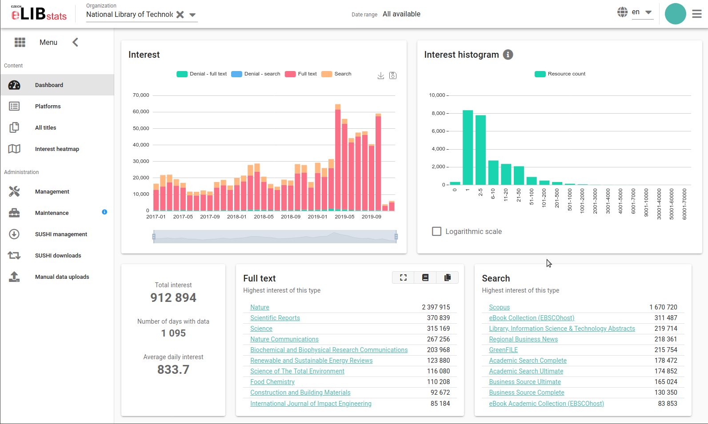

=====
Celus
=====

Celus (from CzechELib Usage Statistics) is a web application for harvesting and visualization
of usage data of electronic information sources, such as scientific journals, etc. It was
designed specifically to handle consortia of individual user organizations and separate usage
statistics for each member organization.

You can find the documentation at Read the Docs:

* `production version <https://celus.readthedocs.io/en/latest/index.html>`_
* `development version <https://celus.readthedocs.io/en/devel/index.html>`_

License
-------

Celus is open-source project licensed under the MIT license. It is offered as-is without
warranty of any kind.

This repository contains the code as it is used by the CzechELib consortium. For customization,
we recommend creating a fork of the repository and modifying the code there.

Please use the "Issues" feature of Github to report any problems with the software. Fixes
of improvements in form of pull requests are welcome.
