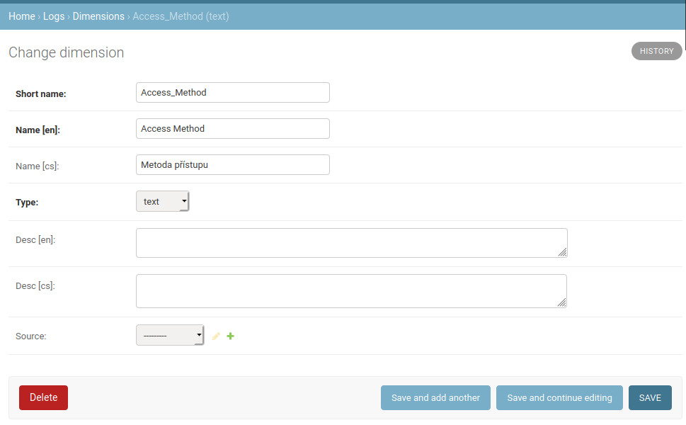
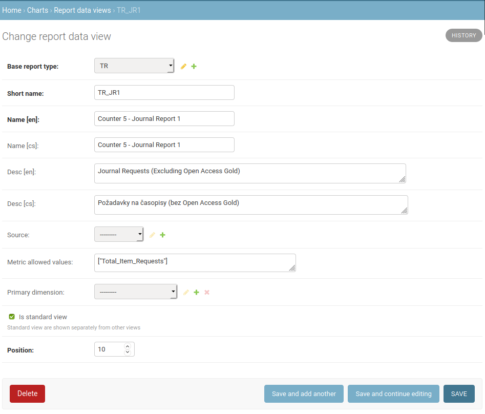

===================
Admin documentation
===================

This document describes administration of the Celus application. For user documentation
see :doc:`user`.

--------------------
System configuration
--------------------

Defining report types
=====================

Report types are not hard-coded in the Celus codebase, but rather defined in the database.
This allows flexible creation of new report types, especially in case of custom manually uploaded
data. The following steps describe how to create a report type from scratch. You may also use
existing report types as inspiration when creating your own data types.

Creating report type
--------------------

Report types are available in the Django admin interface in the `Logs` > `Report types` section.
To create a new report type, use the `Add report type` button in the upper right corner of the
above mentioned page.

You will be presented with a dialog similar tot he following:

.. image:: images/dja_add_report_type.png

Fill in the basic information about the report type. The `Short name` is used in some drop down
menus in Django admin, etc., so use something short but obvious and easily recognizable. The
`Name` is present in several language versions. You should fill in at least the English version.
The `Name` is used when presenting this report type to the user, so make it clear. The description
can be used to further obviate the meaning and purpose of this report type.

You do not have to fill the `Source`. The `Superseeded by` attribute is used when you have
the same data available from different report types and you want to make sure that only the newest
version is used when computing interest. You would probably leave it empty in most cases, but
it is useful when specifying that `COUNTER 4` reports are superseeded by `COUNTER 5` reports
and interest data should be preferentially calculated from version 5.

When filled in, submit the form by clicking on `Save` in the lower right corner.

.. image:: images/dja_add_report_type_filled.png

Now we have the report type created, but this is only the beginning. We have to tell Celus how
the data for this report should be saved and also presented to the user.

Adding dimensions to the report type
------------------------------------

Depending on the nature of the report type, each data point can have many dimensions, such as
the date, title name, publisher name, name of metric, type of user accessing the e-resource, etc.
In order for Celus to be able to properly import the data from a source file, it has to know about
these dimensions.

Some of the dimensions are implicit and do not have to be specified. These are:

* date
* title
* organization
* platform
* metric

Other dimensions used by that report type, if any, must be added to the report type in the Django
admin.

When adding a new dimension that is not used by any other report type, the dimension has to be
created. You can do so in the Django admin in section `Logs` > `Dimensions` by using the
`Add dimension` button in the upper right corner.

Short name
    the value as it appears in the source files - that is in COUNTER
    report or as column headers in the tables that you upload to Celus.

Name
    localized name of the dimension as it appears to the user.

Type
    ``text`` for most data, but for integer data ``integer`` type is preferential.

Desc
    Description of the dimension. It may be useful for other admins. It is not displayed to the
    user.

You can leave the `Source` field empty.

When all dimensions are associated with a report type, it is ready for users to upload data
of this type. However, to visualize the data, more has to be done.

Creating a report data view
---------------------------

A report type (described above) describes how data are read from a source file and how it is stored
in the database. To make the presentation of the data more flexible, Celus uses "report data views"
which define one of more different views of the underlying report type data.

In order to make a report type accessible in the user interface, at least one report data view
has to be created for it.

Report data views are created in the `Charts` > `Report data views` part of the Django admin.
In the screenshot below, you can see the definition of view which creates JR1 view from the
underlying COUNTER 5 TR master report.

The meaning of each attributes is as follows.

Base report type
    The report type for which this view should be used - defines the underlying report type.

Short name
    Mostly internal short version of the report view name - used in some dropdown menus in
    the admin, etc.

Name
    Localized version of the view name - this is the name users see in the UI.

Desc
    Localized version of the description of the view - it is presented in some places of the UI
    together with the name.

Source
    You can leave this empty

Metric allowed values
    If the view should not present all metrics from the underlying report, but only some of them,
    you can list them here ``["Metric one", "Metric two"]``. This is a list in the JSON format,
    so please be careful about the proper formatting of data. To allow all metric values, use
    empty list (``[]``). If any values are present in the list, only these metrics will be shown.

Primary dimension
    A remnant of a previous version kept only for backwards compatibility. Not used anymore

Is standard view
    When checked, it means this view will be presented to the user in a dropdown menu in section
    "Standard views". Otherwise it will be shown in the following section. This option is usually
    checked.

Position
    A relative number which is used to sort the views in the dropdown menu presented to the user.
    Please note that the numbers are only relative, so it does not matter if the number is
    10 or 10000, the only thing that matters is the size of the numbers relative to other views.
    Please note as well that only views for which there are any data on a specific page are
    presented to the user. This means that for example COUNTER 5 views are not shown to users
    on platforms which only have COUNTER 4 data.

Note that there may be more than one view of the same report type data. For example all the
TR_JR1, TR_BR1 and other reports in COUNTER 5 are created in this way in Celus from the
underlying COUNTER 5 TR master report.

When you save a report data view definition, you are ready for the last part of making the
data available to the user.

Associating charts with report data views
-----------------------------------------

The last step in making a new report type available to users is to tell Celus which charts
should be presented to the user if he selects the report data view (see above) associated with
the report type.

To define the list of charts for a view, you need to visit `Charts` > `Report view to chart types`
where you will find a list of already created associations. To create new one, click on
`Add report view to chart type` in the upper right corner and fill in the form as shown below:

.. image:: dja_add_report_view_to_chart_type.png

Report data view
    Select the report view for which you want to make a chart available

Chart definition
    Select one of the existing chart definitions. (You can also
    `create new one <Creating chart definitions>`_ yourself and then
    return back here if none of the existing suits you.)

Position
    A relative number which defines the order of charts in which they are presented for the
    report view at hand.

Once you fill in the data and save the definition, the user will be able not only to view
the report view name in the selection of available reports for matching platforms, but also to
choose from available charts after he selects it.

Creating chart definitions
--------------------------

To be added

-----------
Maintenance
-----------

Removing unsuccessful SUSHI downloads
=====================================

Celus tries to be smart about downloading data using the SUSHI protocol. It does not re-fetch
data for platforms and months for which data was already successfully retrieved or for which
there were too many unsuccessful attempts.

This "intelligence" can sometimes become unwanted, for example when a platform releases corrected
data after fixing an error on their side or when access is finally fixed after many unsuccessful
attempts (e.g. when an IP address is finally added to the providers list of allowed addresses).

In these cases the previous downloads (or attempts) block the correct data from being downloaded
and it is necessary to remove them for the system to redownload the data.

This can be accomplished using the Django admin interface.

1. Navigate to the `SUSHI` app and click on the link to `Sushi fetch attempts`. Here all attempts
   to fetch SUSHI data are stored - regardless of their success.

   .. image:: images/dja_sushi_app.png

2. In the list of `Sushi fetch attempts` use the right-side panel to filter the fetch attempts
   to the desired set. The `organization` and `platform` filters are most likely to be useful.

3. Once you have the list of attempts narrowed down to the desired platform and organization
   (and possibly using other criteria), check the checkmark on the left of each of the attempts
   you wish to delete and select the action `Delete selected attempts including related usage data`
   from the dropdown menu at the top of the table. Then press the `Go` button just to the side of
   the dropdown.

   .. image:: images/dja_sushi_attempt_delete.png

Once you have deleted the corresponding SUSHI fetch attempts, the system will automatically
try to re-download the data for the organizations, platforms and dates you have just cleared up.

The download will take place in the next scheduled download window. The specific timing depends
on your system settings.
