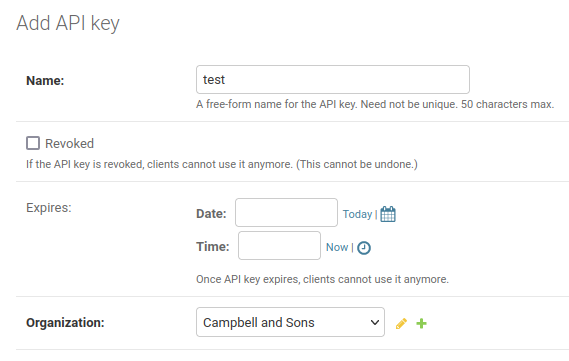
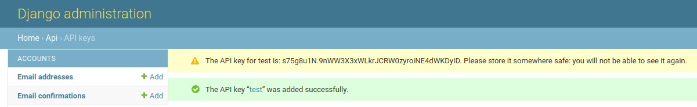

============
External API
============

CELUS offers a simple API to access the usage data stored in the system. The API uses an authorization
mechanism independent of the CELUS web interface which is based on API keys. The API key is
always connected to one organization and can be used to access all data of this organization.

--------
API Keys
--------

Generating API keys
===================

To generate an API key, you need to access the Django admin interface, so you need a high enough
access level. Then, go to the "API / API keys" section (not the "API key permissions" section)
and click on "Add API key" in the upper right corner. You will be asked to enter a name for the
key and to select the organization for which the key should be valid.

If you want, you can also select an expiration date for the key. If you do not select an expiration
date, the key will never expire. (If you want to revoke the key, you can simply delete it in the
Django admin interface or mark it as revoked.)

Immediately after creating the key, you will be shown the key. This is **the only time** you will
see the key, so be careful not to leave the page before copying it.
If you lose the key, you will have to create a new one.

The key will be shown in the upper left corner of the page on yellow background.

After creating the key, you can also see the key in the list of keys. You will see its prefix,
but not the full key.

**Warning:** Store the key in a safe place as it can be used to get all the usage data for the
selected organization. At present, the API allows read-only access to the data, so the security
consequences are not that severe. However, this may change in the future.

Using the API keys
==================

The external API is a REST API which uses JSON as the data format. When making a request, you
need to set the ``Authorization`` header to the value "``Api-Key YOUR_FULL_KEY``" on every request.
The path for each API endpoint is described below.

-------------
API endpoints
-------------

Platforms
=========

Path: ``/api/platform/``

This endpoint returns a list of all platforms which are available in this particular CELUS
instance. The records look like this:

.. code-block:: json

    {
        "pk": 1,
        "ext_id": 92,
        "short_name": "AAAS",
        "name": "AAAS/Science",
        "provider": "AAAS",
        "url": "http://ScienceOnline.org",
        "counter_registry_id": "38b08a9f-4828-4ab8-82ff-38c6cffcc434"
    },
    {
        "pk": 68,
        "ext_id": 93,
        "short_name": "AACN",
        "name": "AACN Advanced Critical Care",
        "provider": "AACN",
        "url": "https://aacnjournals.org/",
        "counter_registry_id": "3d22837e-2033-4fa3-9a89-4e8cad078fc9"
    },
    {
        "pk": 70,
        "ext_id": 95,
        "short_name": "AAP",
        "name": "AAP - American Academy of Pediatrics",
        "provider": "AAP",
        "url": "https://www.aap.org/",
        "counter_registry_id": "f5767601-0438-476a-9c42-1a5848918962"
    },

This endpoint does not require any parameters.

This endpoint is useful for getting the IDs of platforms to be used in other API endpoints. The
IDs are the ``pk`` values in the JSON records.

Report data
===========

Path: ``/api/platform/{platform_id}/report/{report_code}``

Where:

* ``platform_id``: The ID of the platform for which the report should be generated. This is the
  ``pk`` value of the platform record in the JSON returned by the ``/api/platforms/`` endpoint.
* ``report_code``: The code of the report to be generated. The values correspond to the COUNTER
  specification, e.g. ``JR1`` for the Journal Report 1, or ``TR`` for the Title Master Report
  in COUNTER 5.

The API endpoint also uses the following parameters:

* ``month``: The month for which the report should be generated. The value must be a string in
  the format ``YYYY-MM``. This parameter is required.
* ``dims``: A list of dimensions which should be included in the output data delimited by ``|``. The
  values correspond to the COUNTER specification, e.g. ``Platform`` or ``Publisher``. This
  parameter is required, but its value may be empty. In such case no dimensions will be included
  in the output data.

The API endpoint returns a JSON object with the following structure:

.. code-block:: json

    {
      "records": [
        {
          "hits": 7,
          "metric": "No_License",
          "title": "Cell",
          "isbn": "",
          "issn": "0092-8674",
          "eissn": "1097-4172",
          "doi": ""
        },
        {
          "hits": 46,
          "metric": "Total_Item_Investigations",
          "title": "Cell",
          "isbn": "",
          "issn": "0092-8674",
          "eissn": "1097-4172",
          "doi": ""
        }
      ],
      "status": "OK",
      "complete_data": true
    }

If some dimensions are requested, the individual ``records`` will contain the values for these
dimensions:

.. code-block:: json

    {
      "records": [
        {
          "hits": 3,
          "metric": "No_License",
          "Access_Type": "Controlled",
          "Data_Type": "Journal",
          "title": "Cell",
          "isbn": "",
          "issn": "0092-8674",
          "eissn": "1097-4172",
          "doi": ""
        },
        {
          "hits": 3,
          "metric": "No_License",
          "Access_Type": "OA_Gold",
          "Data_Type": "Journal",
          "title": "Cell",
          "isbn": "",
          "issn": "0092-8674",
          "eissn": "1097-4172",
          "doi": ""
        }
      ],
      "status": "OK",
      "complete_data": true
    }

As you can see from the examples above, the usage is reported by individual titles and broken
down by metric. If any dimensions are requested, the usage is also broken down by the values of
these dimensions. Any dimension which is not requested will not be included in the output data
and the usage value in the ``hits`` field will be aggregated for all values of that dimension.

Please note that the response of this endpoint **may be quite large** and may take some time to
generate. In order not to overload the server, you should not make more than one request at
the same time.

The ``complete_data`` field indicates whether the data returned by the API endpoint is complete.
If the data is not complete, the ``status`` field will contain a message explaining why the data
is not complete. One possible reason is that there is no data for the requested report. In such
case, CELUS will return a reply similar to this:

.. code-block:: json

    {
      "records": [],
      "status": "SUSHI credentials not present for this report",
      "complete_data": false
    }

Also, the data may not be present for the month for which the report is generated. In such case,
CELUS will return a reply similar to this:

.. code-block:: json

    {
      "records": [],
      "status": "Data not yet harvested",
      "complete_data": false
    }

Reporting export
================

This endpoint allows you to query a report from the reporting module, which was created manually
by a user. The endpoint makes is easy to visually assemble and fine-tune a report in CELUS and
then query it programmatically.

To make the stored reports more versatile, the API allows overriding the start and end dates of
the stored report, thus making it possible to query the report for any time period.

Prerequisites and limitations
-----------------------------

To use this endpoint, you need to:

* have a report created in the reporting module - you will **reference it by its ID**, which is part
  of the URL in the CELUS web interface when you open the report
  (e.g. ``/analytics/flexible-reports/265?edit=true`` means the report ID is ``265``).
* the stored report must have the **visibility set to "Organization"** with the organization set to
  the organization of the API key you are using. Trying to access a report with other visibility
  will result in an authorization error.

Please also note that the output of the report will be limited by the following factors:

* when **using tags in the report** - either for filtering or grouping - the API will only be able
  to work with tags visible to the users or admins of the organization of the API key. This could
  cause differences in the output of the report compared to the web interface, if the report uses
  tags private to the user who created the report.
* similarly to the above, users have the possibility to hide some tags by default. Such tags
  are not shown in reports generated for that user. However, as the API works with the organization,
  hiding of tags on the user level does not affect the API output.

Starting an export
------------------

Path: ``/api/reporting-export/``

Method: ``POST``

Request body:

* ``report``: The ID of the report to be processed and exported. See the prerequisites above.
  This parameter is required.

* ``start_date``: The start date of the time period for which the report should be generated. The
  value must be a string in the format ``YYYY-MM-DD``. This parameter is optional. If not set,
  the stored value from the report will be used. When ``start_date`` is given, ``end_date`` must
  also be given to prevent unexpected results when mixing stored and given values.

* ``end_date``: The end date of the time period for which the report should be generated. The value
  must be a string in the format ``YYYY-MM-DD``. This parameter is optional. If not set, the stored
  value from the report will be used. When ``end_date`` is given, ``start_date`` must also be
  given to prevent unexpected results when mixing stored and given values.

* ``file_format``: The format in which the report should be exported. This parameter is optional.
  If not given, the default value (``XLSX_NO_CHARTS``) will be used. When given, the value must be
  one of:

  - ``XLSX_NO_CHARTS`` (Excel file without charts, this is the default)
  - ``XLSX`` (Excel file with charts)
  - ``CSV_ZIP`` (CSV files in a ZIP archive)

Response code: ``201 Created``

Response body: The response body will contain the ID of the export job which was started and some
additional information::

    {
      "pk": 47,  # ID of the export job - use this ID to check the status of the job
      "report": 63,
      "start_date": null,
      "end_date": null,
      "created": "2024-05-07T10:41:33.330075+02:00",
      "last_updated": "2024-05-07T10:41:33.330086+02:00",
      "status": 0,  # 0 = job not started, 1 = job running, 2 = job has finished
      "output_file": null,  # URL to the output file, if the job has finished
      "progress": [0, 0],  # [current step, total steps], may contain null values when finished
      "file_size": 0,  # size of the output file in bytes, if the job has finished
      "file_format": "ZIP_CSV",
      "error_info": {  # only contains information when the job has finished with an error
        "detail": null,
        "code": null
      }
    }

Because the export can potentially take a long time, it is not done synchronously. Instead, a
background job is started and the response contains the ID (``pk``) of the job. You can use this ID
to periodically check the status of the job. You can also use the ``progress`` field to see how far
the job has progressed. It contains two values: the current step and the total number of steps. The
number of steps reprents the number of rows in the output file. The ``progress`` field may contain
``null`` values when the job has finished.

Checking the status of an export
--------------------------------

Path: ``/api/reporting-export/{export_id}/``

Where ``export_id`` is the ID (``pk``) of the export job.

Method: ``GET``

Response code: ``200 OK``

Response body: The response body will contain the status of the export job. See the response body
of the ``POST`` request for details.

Requests to this endpoint can be made at any time to check the status of the export job. Unless
there is large traffic on the server, the export job should be started within a few seconds after
the ``POST`` request. The export job should finish within a few minutes, depending on the size of
the report and the server load.

Once the job has finished, the ``output_file`` field will contain the URL to the output file. You
can download the file from this URL.
