====
Tags
====

.. contents::
   :depth: 3
   :local:

Tags are a new feature introduced in Celus 5.0 which allows users to attach arbitrary labels to
individual titles, platforms and organizations.

Tags may be used for filtering of the corresponding lists (list of titles, platforms, organizations)
and in the reporting module.

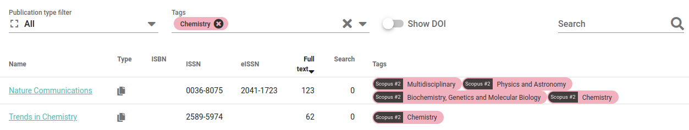

---------
Use cases
---------

Tags are a generic feature which can be used for a variety of purposes. Some of the use cases are:

* tagging titles by collection to compute statistics for the whole collection
* tagging titles by topic or subject area for purposes of filtering or statistics
* tagging of member institutions by organization type, membership type, etc.
* ad-hoc tagging of individual titles to enable their comparison in the reporting module

------------------------------
Grouping of tags - tag classes
------------------------------

Because there are many different purposes for using tags, it is important to have a way of
organizing them. In Celus this is accomplished by the so called tag classes which are similar
to folders and represent one specific type of tag. For example one tag class for titles could
be “collection”, which would contain several tags named by individual collections, while another
would be “topic” with tags like “chemistry”, “biology”, etc.

Exclusive tags
==============

While you can assign as many tags to an item as you wish, there are specific types of labels for
which individual values are mutually exclusive. For example you might want to split you member
institutions between public libraries and university libraries. To ensure that it would not be
possible to assign both tags to one institution, you can mark the corresponding tag class as
exclusive and Celus will enforce the mutual exclusiveness of individual tags.

One important feature of tags from exclusive class is that when you compute usage by individual
tags, you can safely sum it up to produce a meaningful total.

-------------
Access rights
-------------

There are four types of permissions / access rights which influence the behavior of tags:

===========  ===============  =========================================================================
Assigned to  Action           Desciption
===========  ===============  =========================================================================
Tag class    edit             Who can edit and/or delete a tag class
Tag class    add tags         Who can add new tags to a class, modify existing tags and delete them
Tag          assign to items  Who can assign a tag to individual items, such as titles, platforms, etc.
Tag          view             Who can see the tag in the user interface
===========  ===============  =========================================================================

Each of these access rights can have several values:

====================  ====================================================================
Value                 Description
====================  ====================================================================
Everybody             Every logged in user can perform the action
Organization members  Only members of a specified organization can perform the action
Organization admins   Only administrators or specified organization can perform the action
Consortium admins     Only consortium administrators can perform the action
Owner                 Only the owner/creator of the tag/tag class can perform the action
System                No user can perform the action, it is reserved internally for Celus
====================  ====================================================================

Combining the above access rights with different values allows creating tags for a wide variety of
use cases. Here are some examples:

* Consortium admins can tag each organization by their subscription status without anybody else
  being able to see the tags.
* Consortium admins can tag titles by the name of a collection. All users will be able to see the
  tags and use them for filtering, but only consortium admins will be able to modify the
  assignments.
* Organization admins can create a set tags which would express importance of a specific title
  and let their users assign them to individual titles. The tags would be only visible inside the
  organization at hand.
* Any user can create tags for his/her personal use and then use them for ad-hoc filtering of
  titles in the reporting module.

-----------------
Working with tags
-----------------

Creating tags
=============

Tags are managed in the “Tags” section of the main menu. Before you can start using tags, you
need to create at least one tag class and at least one tag.

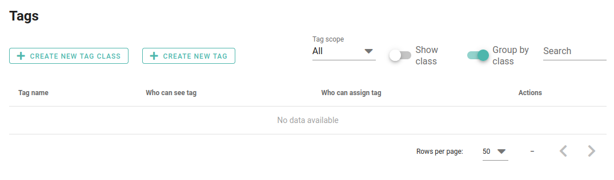

To create a tag class, use the “Create tag class” button as shown above.

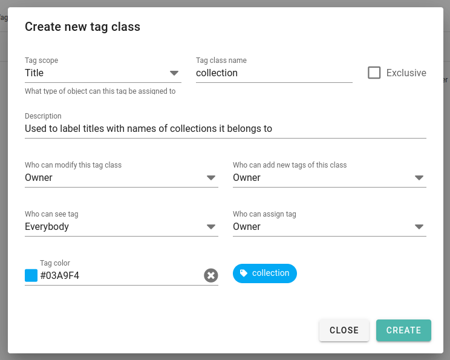

Please note that a tag class has always a scope assigned to it. It specifies to which type of
items the tags in the class can be assigned. For example, you can create a tag class for titles
by assigning it the scope “Titles”. Tags of this class can only be used for titles, not for example
platform.

See `Exclusive tags`_ above for more information about the “Exclusive” checkbox.

When you create a new tag class, do not be alarmed that it does not show in the list of tags.
Only tag classes containing at least one tag are shown in the list. To add a tag to a class,
use the “Add tag” button.

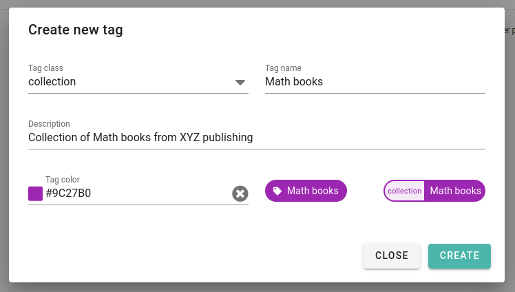

After you create the new tag, it will be automatically shown in the list of existing tags:

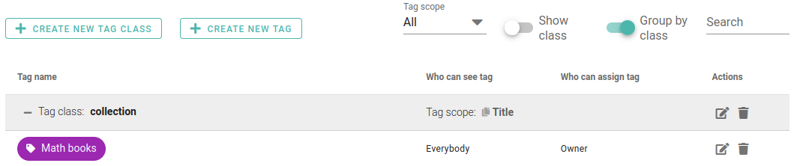

You can create as many tags as you wish. To edit a tag, click on the “Edit” button next to it.
When you create a tag, it will inherit the color from the tag class. You can choose a different
color when creating or editing a tag.

Assigning tags
==============

Tags are assigned to individual items on the detail page of the item. For example, to assign a
tag to a title, go to the detail page of the title and click the “Edit” icon on the “Tags” card.

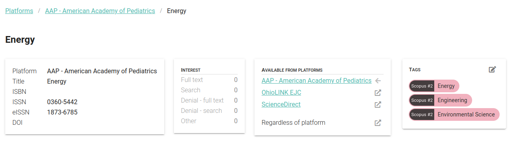

You will be presented with a list of all tags with scope “Title” and you can select the ones
you want to assign to the title.

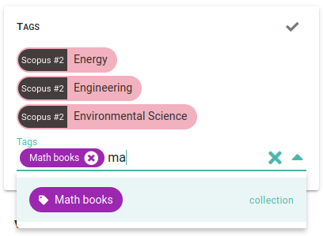

The assignment is finalized when you hit the checkmark icon in the top right corner of the card.

Filtering by tags
=================

The lists of titles, platforms and organizations can be filtered by tags. On each of these pages,
you will find a “Tags” card which allows you to select the tags you want to filter by.

.. image:: images/tags-title-filtering-1-5_0.png
   :scale: 60%

After you select the tags, the list will be filtered to show only the items which have at least one
of the selected tags assigned.

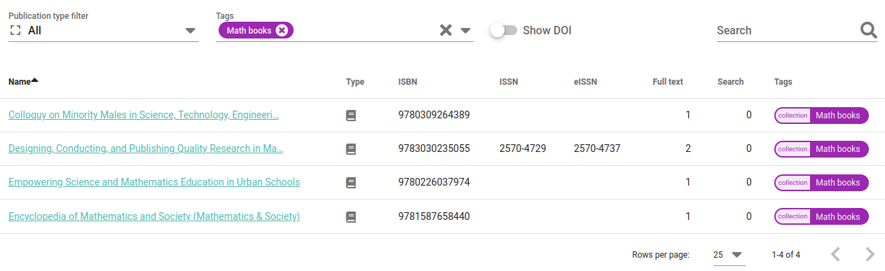

Using tags in reporting
=======================

The reporting module allows you to use tags for both filtering and grouping of the data.

Filtering
---------

When you select to filter by any of the "taggable" items (titles, platforms, organizations),
you will be presented with a list of all tags with the corresponding scope.

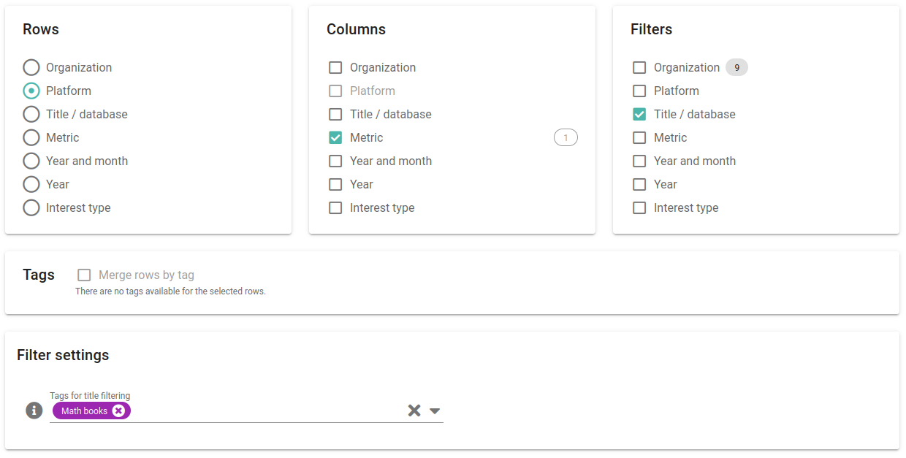

The filter will be applied regardless of whether the item is used in rows, columns or neither of
them. For example, if you select a tag "Math books" for filtering titles and then configure the
report to have platforms in rows and metrics in columns, the report will show only the usage
of titles with the tag "Math books" for each platform.

Grouping
--------

When you configure your report to have one of the "taggable" items in rows, a checkbox
"Merge rows by tag" will appear. If you check it, instead of getting individual items in rows,
you will get one row per tag of the corresponding scope. In this case, it is also possible to limit
the shown tags to only those of a specific tag class.

So if you have for example tagged titles with topic-related tags, you can create a report where each
topic will be shown in a separate row.

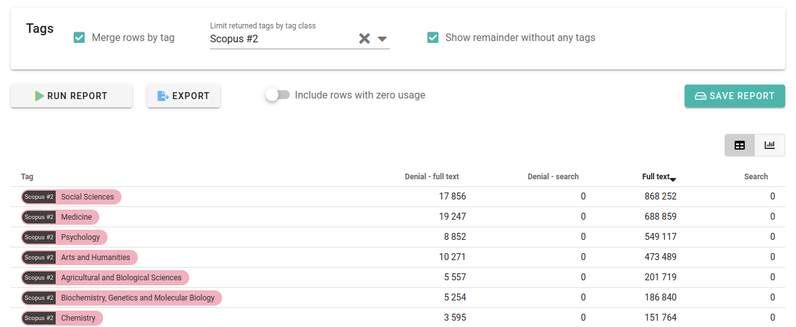

**Note:** Please note that unless the corresponding tag class is marked as "exclusive", the usage
of each item will be counted for each tag it has assigned.

Because it is very unlikely (especially for titles) that you will have each title tagged, it
may be of interest to see the usage of titles which are not tagged. To do so, you can check
the "Show remainder without any tag" checkbox and usage of all items which are not covered by the
shown tags will be shown in a separate row at the bottom of the table.

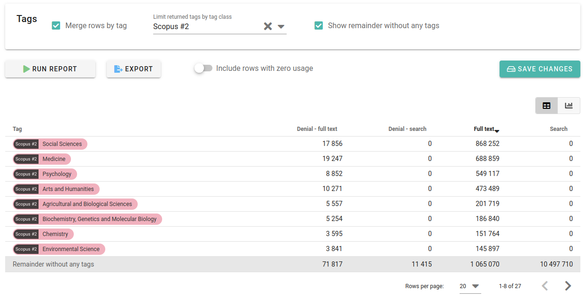

Please note that if you limit the shown tags to a specific tag class, the "remainder" row will
contain the usage of items which are not tagged with any of the tags of the selected class -
regardless of whether they have other tags assigned.
