==================
User documentation
==================

This is Celus documentation for users. For administrator documentation see :doc:`admin`.

The document is divided into three parts depending on the access level of the user:

* `General information`_ - information independent of user access level and general information.
* `Normal access`_ - for users without special privileges.
* `Privileged access`_ - for users with administration access to one or more organizations.

See `Understanding access levels in Celus`_ below for explanation of differences between the access
levels.

-------------------
General information
-------------------

Supported browsers
==================

The following modern browsers are fully supported (minimum version is in backets):

* Chrome and Chromium (75+)
* Firefox (70+)
* Safari (10+)
* Edge (43+)

There is also partial support for Internet Explorer version 11, but since this browser is
very much obsolete, the support is not full and no effort is put into improving or maintaining it.

Understanding access levels in Celus
====================================

`Celus` has the following access levels:

*normal user*
  has read-only access to all data related to organizations he/she is explicitly
  assigned to.

*organization admin*
  besides the same access as `normal user` can also make changes related
  to organizations he/she is explicitly assigned to with the admin status. The same user may be
  assigned to several organizations with admin access to only some of them. The user may view
  and change SUSHI credentials for all platforms for his organization, may add annotations to
  data related to his organization, may manually upload data for any platform for his organization.

*master organization member*
  one or more organizations may be assigned the `master status`
  in `Celus` which means that the users from this organization are allowed to perform some actions
  for the whole consortium.
  Users from the master organization may view data for all organizations - not only those explicitly
  assigned. They can also perform all administrative tasks similarly to `organization admins`
  for any organization. They are also allowed some special actions, such as locking SUSHI
  credentials for editing by `organization admins`.

*superuser*
  superuser is a user with complete access to the whole system. He implicitly has
  all privileges of `master organization member` plus he has access to the Django administrative
  interface with almost direct access to the underlying database.

-------------
Normal access
-------------

.. _interest-intro:

Interest - what it means and how to interpret it
================================================

Statistics obtained from publishers use many different metrics, such as "Items displayed during
search", "Items retrieved by the user", etc. Without knowing exactly how each of these metrics
is defined (either in the COUNTER standard or outside of it for custom data), it is sometimes
difficult for normal users to understand the presented statistics.

In order to simplify this and give users one specific measurement of how much each e-resource
is used, we devised the concept of **interest**. This one value should make it possible to more
easily compare values between different titles, platform and also time periods. It should also
enable easier comparison between data obtained using different version of COUNTER.

Because different platforms focus on different types of services, the definition of interest cannot
be the same. Some platforms offer searching capabilities, some offer full texts of journal articles
or access to whole electronic books. In order to make it possible to distinguish between these
cases, Celus uses more than one interest type.

Interest types
--------------

When creating Celus, we saw two basic types of services that e-resource platforms offer - access
to full texts and database searching. Therefore we made it possible to use different types of
interest for these services and created the `Full text` and `Search` interest types. Thus it is
possible to easily distinguish between types of platforms and in case a platform offers both
types of services (e.g. EBSCO) compare the two types of interest.

Another important aspect of interest is that users express it both when they successfully access
the e-resource and when they are denied access. In order to incorporate this into Celus in a way
that would not cause confusion (as could happen if the two types of interest were simply mixed
together), we also created a corresponding types of interest called `Denial - full text` and
`Denial - search`. These represent denial data related to the previously mentioned types of
interest which are used only for successful access to a resource.

For platforms that fall outside of the scope of `full text` vs `search`, there is also the `Other`
type of interest used in specific cases.

-----------------
Privileged access
-----------------

.. _work-with-sushi:

Setting up, editing and debugging SUSHI
=======================================

SUSHI management
----------------

Setting up SUSHI downloading for your organization is usually the most important task you have to
perform in `Celus`. Management of SUSHI is only accessible to users with organization admin
access (see `Understanding access levels in Celus`_ for details).

To manage SUSHI credentials, use the **SUSHI management** link in the side navigation:

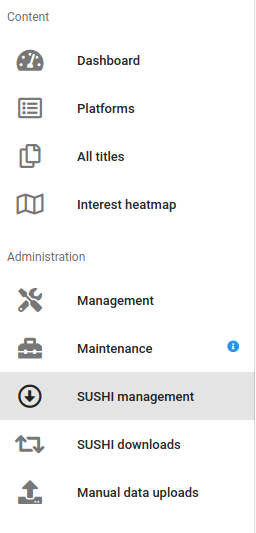

The `SUSHI management` page, presents a list of all SUSHI credentials set up of the currently
active organization. You may filter the content of the list by entering text into the search
field above the list. You may add new SUSHI credentials using the "ADD NEW SUSHI" button:

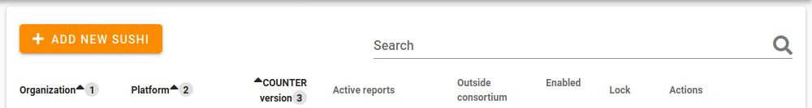

The table listing individual SUSHI credentials records may also be reordered by using clicking
on the headers of individual columns. The table has the following columns:

*organization*
  Usually the current organization unless you have access to all organizations

*platform*
  For each combination of platform and COUNTER version there may be only one set of SUSHI
  credentials

*COUNTER version*
  Each platform may support more than one COUNTER version. At present time 4 and 5 are valid
  options.

*active reports*
  List of reports that are activated for the platform at hand for the specified COUNTER version.

*outside consortium*
  This attribute helps in distinguishing between SUSHI credentials for platforms access to which
  was obtained through the consortium and those bought separately by the organization. Only
  `master organization member` or `superuser` users may create SUSHI credentials marked as not
  outside consortium. When organization admins add SUSHI credentials, these are automatically
  marked as `outside consortium`.

*enabled*
  When the record is enabled, the credentials are used for periodic downloads of new data using
  the SUSHI protocol. Deactivating the credentials is a simple way how to remove them from
  automatic downloading without deleting them.

*lock*
  `Master organization member` or `superuser` users may lock SUSHI credentials. Locked credentials
  may not be edited by `organization admins`. The key icon is present for users who are allowed
  to lock and unlock the record. Clicking on the key changes the lock status of the record.

*actions*
  Users with the adequate access rights may edit the credentials using the "EDIT" button and
  view list of already performed attempts to download data using the "DOWNLOADS" button.

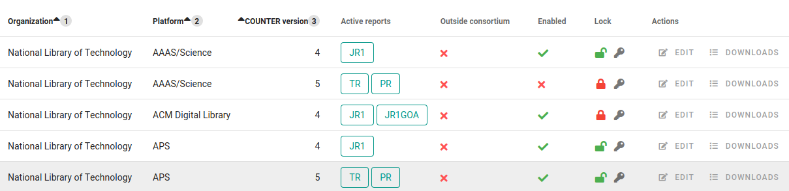

Adding new SUSHI credentials
----------------------------

You add new SUSHI credentials using the "ADD NEW SUSHI" button at the top of the list of SUSHI
credentials. A dialog will open with all relevant data.

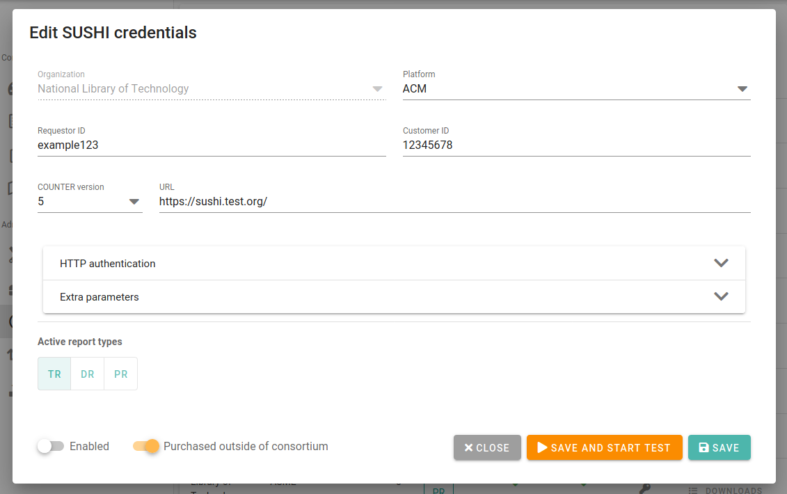

You have to fill the required minimum of parameters before it is possible to save the credentials.
Your provider should give you all information that you will need on this page.
The dialog contains the following entries:

*organization*
  The organization will be prefilled with the one currently active.

*platform*
  You may select amongst all available platforms, but if you select a platform for which credentials
  for all supported COUNTER versions are already present, it will not be possible to select
  COUNTER version and save the record.

*requestor ID*
  It identifies the party requesting the data. For some platforms, it matches the `Customer ID`,
  for some it is different from it and for some it might even be empty.

*customer ID*
  Identifies the organization for which data should be downloaded. This is a mandatory field.

*COUNTER version*
  This drop-down menu contains only the values that are supported by the system and which don't
  already have a record set up for this organization and platform. In case credentials for all
  supported COUNTER version are already defined, there will be no value to select and the
  credentials cannot be saved. You have to instead edit the matching existing record.

*URL*
  The URL of the SUSHI server. This is a mandatory field. If the URL provided to you by the
  provider ends with ``/reports/``, remove this part as it will be supplied automatically.

*HTTP authentication*
  Some providers add extra protection to their SUSHI data. Here you can supply the username and
  password for HTTP authentication if it was given to you by the provider explicitly for the purpose
  of accessing SUSHI.

*Extra parameters*
  If you have been provided with some extra parameters for accessing SUSHI, this might be the
  right place to put them. Most often ``API key`` is used as extra protection and it may be
  stored here. For other data, you may use the "ADD CUSTOM PARAMETER" button and define the name
  and value of the extra parameters. This option is used only very seldom.

*Active report types*
  A list of reports that are available for the selected COUNTER version (note that if no COUNTER
  version is selected, the list here will be empty). Check at least one of them you wish to
  download.

*Enabled*
  Enabled credentials are used to automatically download data from the defined source. Unless you
  enable the credentials, nothing will be automatically downloaded.

*Purchased outside of consortium*
  Marks credentials that are for platforms for which access was bought directly by the organization
  and not through the consortium. Only `Master organization member` or `superuser` users may
  switch this off.

The bottom of the dialog window also has the following buttons:

|DELETE|
  Only visible if the credentials were already saved. Removes the credentials from the system.

|CLOSE|
  Closes the dialog. If the content was not saved, it will be lost.

|SAVE_AND_TEST|
  Saves the credentials and opens a dialog that allows immediate testing of the supplied
  credentials. It is considered good practice to immediately test newly created credentials.
  See `Debugging SUSHI`_ for more details.

|SAVE|
  Saves the credentials and closes the dialog.

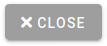
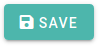
.. |SAVE_AND_TEST| image:: images/sushi_button_save_and_test.png
                   :alt: SAVE AND TEST

Editing SUSHI credentials
-------------------------

You can edit SUSHI credentials by clicking the "EDIT" button in the `Actions` column of the
table listing all defined SUSHI credentials.

If the "EDIT" button is not present, you are not allowed to edit the credentials. This usually
means that the record was locked and your access level is `organization admin`.

When you click the "EDIT" button, a dialog identical to the one presented in the previous part
about creating SUSHI credentials will be opened with the exception that there will be the
extra "DELETE" button.

Please refer to `Adding new SUSHI credentials`_ for detailed description of this dialog.

Debugging SUSHI
---------------

There are a lot of things that can go wrong when dealing with SUSHI and it might be challenging
to find the exact source of problems. The following paragraphs describe how to best debug SUSHI.

Test SUSHI credentials
++++++++++++++++++++++

When the dialog for editing SUSHI credentials is open (see `Adding new SUSHI credentials`_),
you may use the |SAVE_AND_TEST| button to immediately test the credentials at hand.

By clicking the button a new dialog will be opened where you can enter the start and end months
for which `Celus` should try to download data. Because retreiving the data can sometimes take a
long time, we recommend using only one month (by using the same month for both start and end
dates) in order to minimize the amount of data a speed up the process.

Then you hit the "START TEST" button to run the test.

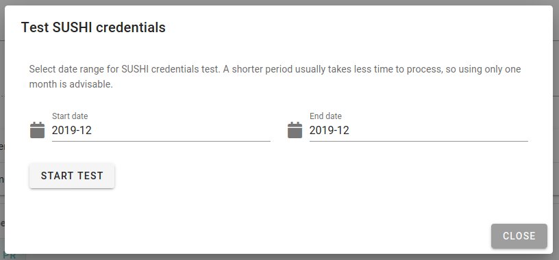

`Celus` will the try to download reports for all report types defined in the SUSHI credentials
record. It will provide the information about the progress of the test and at the end display
the results.

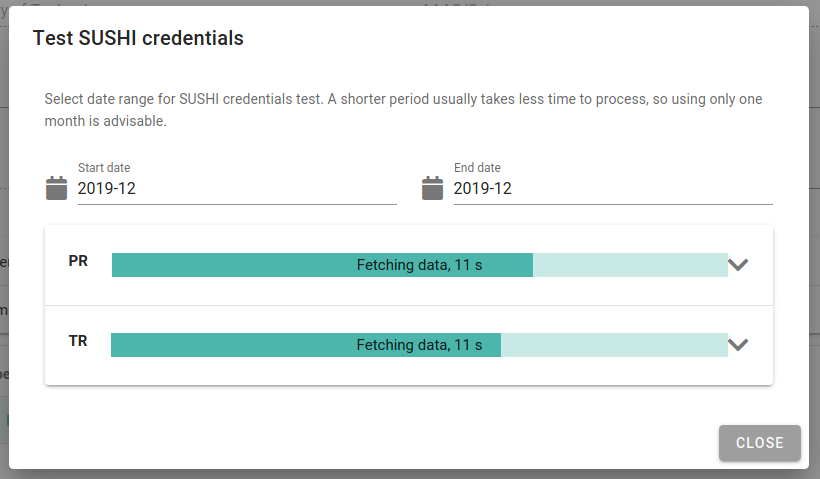

If everything goes well, you will see only green check marks.

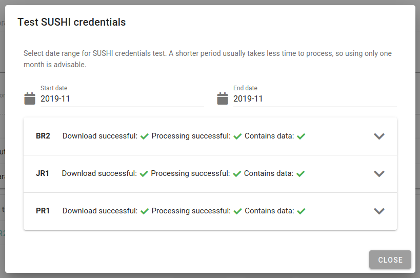

But sometimes things go wrong and some red crosses appear. You can click on each report name to
see details of what went wrong. This information should help you determine how to fix the problem.

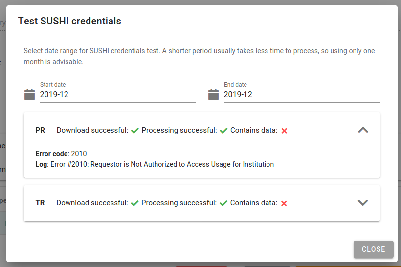

See the `Common SUSHI problems`_ section for more info about common cases.

Reviewing past downloads
++++++++++++++++++++++++

It is useful to review past SUSHI downloads from time to time - especially if you have a suspicion
that some data is missing.

To do so, there are two possibilities. You may use the `SUSHI management` page, find the
SUSHI credentials at hand and use the "DOWNLOADS" button to display a list of all attempts to
fetch data for the credentials at hand.

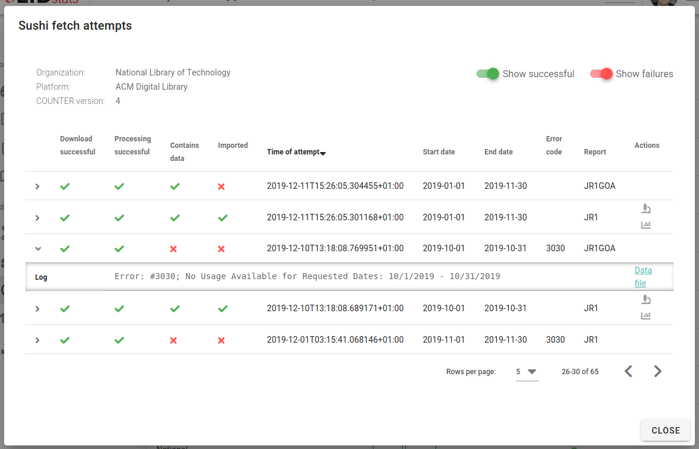

You will get a similar view if you use the `SUSHI downloads` page which is described in details
below.

The list of attempts made for one set of credentials contains some info about the status of the
attempt in form of green checkmarks or red crosses. These represent individual steps in the processing
of SUSHI data:

*Download successful*
  This is the first stage - if the data could not be downloaded, there is nothing we can do. The
  reason has to be fixed first. The problem is usually in wrong credentials, wrong URL or
  sometimes the IP address of the `Celus` system not being whitelisted by the SUSHI provider.

*Processing successful*
  If data was successfully retreived but contains some errors - wrong format, etc. this column
  will have a red cross.

*Contains data*
  If we downloaded valid SUSHI data, but there is an error code in the response rather than usage
  data, the previous steps will show green checkmarks, but this mark will be a red cross.
  If there is a green checkmark here, it means successful retreival of relevant data.

*Imported*
  Imported means that the data from the downloaded file was already converted into internal
  records in the `Celus` database and it is part of what you see when you look at the usage
  statistics. Because the process of actually importing data into the database is separate
  from the downloading of data, there may be some delay between successful download and import.
  Very seldom it can also happen that the import is unsuccessful.
  If the data is imported, there will be two extra icons in the `Actions` column for displaying
  the data in text and chart forms.

The rest of the column names should be self explanatory. You can also click on individual rows
to display the details of an error and/or a link to the downloaded data.

Common SUSHI problems
+++++++++++++++++++++

*non-sushi*
  When the error code of attempting to download data is ``non-sushi``, it means that it is not
  a standard error code reported back by the SUSHI server using the SUSHI error reporting
  mechanism, but rather some other error. Very often this occurs when the given URL is not
  correct and `Celus` gets an HTML document instead of the expected data. Displaying the downloaded
  document (if available) may help with determining this cause.

*3031*
  ``Service has not yet processed the usage for one or more of the requested months`` -
  usually this means that you have selected a date for which data are not yet available.
  We recommend trying with different month or months.

*3030*
  ``No Usage Available for Requested Dates`` - usually this means that there was no traffic
  for the platform at hand at the selected date. However, some platforms use this error code
  to signal that the data is not yet ready. In both cases, we recommend trying a different date
  to see if there is some data available.

*number*
  Any other number besides the ones described above. These are standard SUSHI error codes. They
  are usually accompanied with a short description which may help you determine the cause of the
  problem. Sometimes your system has already made too many requests to the SUSHI server at hand,
  sometimes the request should be retried in short time. `Celus` can deal reasonably with most
  common cases - by stopping trying other months if the credentials are obviously erroneous,
  by retrying attempts which should be retried, or by stopping attempts when the server
  reports overload.
